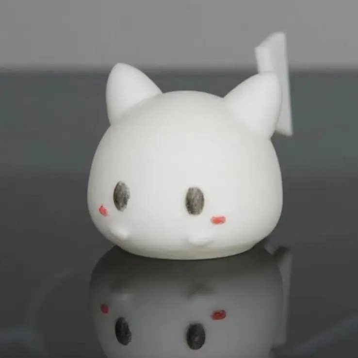

<!--- ### Hi there 👋 --->

<!--
**FFengIll/FFengIll** is a ✨ _special_ ✨ repository because its `README.md` (this file) appears on your GitHub profile.

Here are some ideas to get you started:

- 🔭 I’m currently working on ...
- 🌱 I’m currently learning ...
- 👯 I’m looking to collaborate on ...
- 🤔 I’m looking for help with ...
- 💬 Ask me about ...
- 📫 How to reach me: ...
- 😄 Pronouns: ...
- ⚡ Fun fact: ...
-->

<!--

 
 <h2 align="center">Kevin</h2>

-->

<!--  -->
<!--  -->

|      |                       |              |                                 |
| ---- | --------------------- | ------------ | ------------------------------- |
| 主线 | 待见未来              | Main         | Next                            |
| 称号 | 专业工具研发          | Titles       | Professional Tool Builder       |
|      | 非权威代码分析        |              | Code Analyst                    |
|      | 主流 / 非主流编译前端 |              | Compiler Frontends              |
|      | 未成功创业者          |              | Tingly.Dev Co-Founder           |
|      | 业余 3D Maker         |              | Amateur 3D Maker                |
|      | 非精通美德玩家        |              | Casual Ameri & Euro Board Gamer |
|      | 为 AI 发电            |              | AI Powered                      |
|      | [隐藏称号]            |              | [Hidden Titles]                 |
| 成就 | Github 粉丝           | Achievements | GitHub Enthusiast               |
|      | JetBrains 群众        |              | JetBrains Citizen               |
|      | LLVM 学徒             |              | LLVM Apprentice                 |
|      | Golang 无泛型世代     |              | From the Pre-Generics Go Era    |
|      | AI 使用者             |              | AI Practitioner                 |
|      | Pikachu 制造者        |              | Pikachu Creator                 |
|      | [隐藏成就]            |              | [Hidden Achievements]           |

